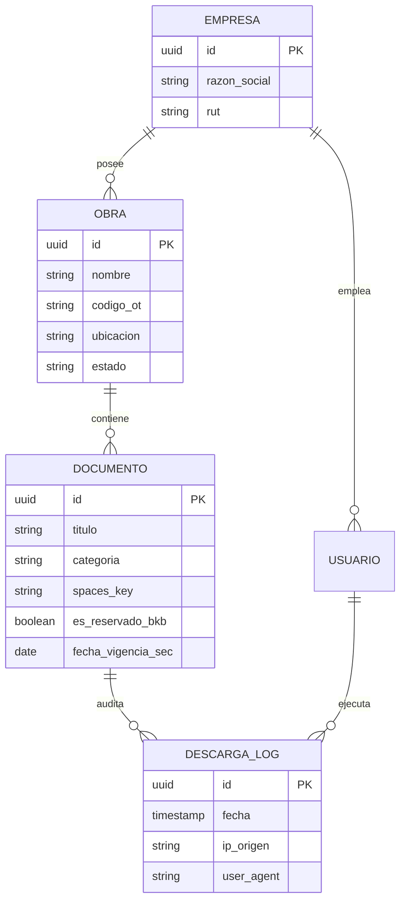

# 03 · Portal de Clientes y Gestión Documental (Django)

> **Nota para IAs y desarrolladores backend:**  
> Este documento define el diseño arquitectónico, el modelo de datos planeado y las políticas de autorización de `apps/portal`.

---

## 1. Misión del Portal
El Portal de Clientes (`portal.bkb.cl`) reemplaza el envío inseguro de planos y certificados por correo o carpetas compartidas de Google Drive. Centraliza la documentación técnica de cada obra contratada con BKB, garantizando confidencialidad y auditoría estricta.

---

## 2. Modelo de Dominio Planificado

---

## 3. Matriz de Acceso y Autorización
La regla fundamental del portal: **Un cliente nunca puede ver ni acceder a documentos de otra empresa.**

| Recurso / Acción | Rol Cliente | Rol Técnico BKB | Rol Administrador BKB |
|---|---|---|---|
| **Certificados SEC TE1** | Ver y descargar (solo sus obras) | Ver y descargar (todas las obras) | Acceso total + carga |
| **Planos As-Built & Dossiers** | Solo sus obras | Todas las obras | Acceso total + carga |
| **Documentos Reservados BKB** | **Oculto / Nombre anonimizado** | Sin acceso | Acceso total |
| **Carga de Documentos** | No permitido | No permitido (por confirmar) | Permitido con asignación de permisos |
| **Gestión de Cuentas** | No permitido | No permitido | Creación, bajas y reseteo |

---

## 4. Ciclo de Vida de Subida y Descarga de Archivos
1. **Subida Segura:** El administrador sube el archivo directo al bucket privado de DigitalOcean Spaces en una carpeta de cuarentena.
2. **Escaneo:** Un worker valida el tipo MIME real, tamaño (máximo 50 MB) y ejecuta ClamAV.
3. **Descarga con URL Prefirmada:** Cuando un usuario autorizado solicita un documento, el portal genera una URL prefirmada de S3 con **60 segundos de validez**. El archivo nunca pasa por el servidor web Django ni queda público en internet.
4. **Auditoría Inmutable:** Cada solicitud genera un registro en `DescargaLog` (usuario, documento, timestamp, IP).
